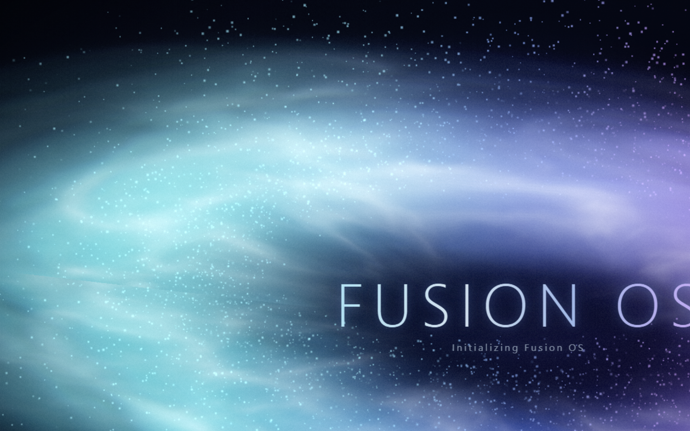
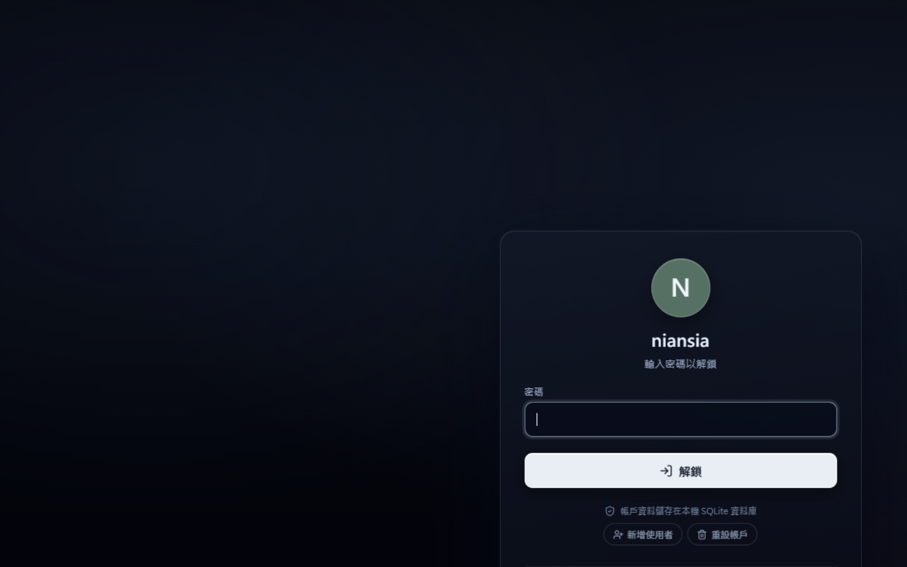
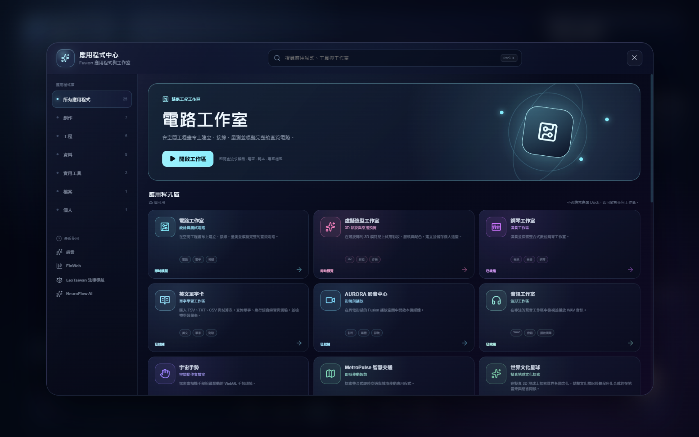
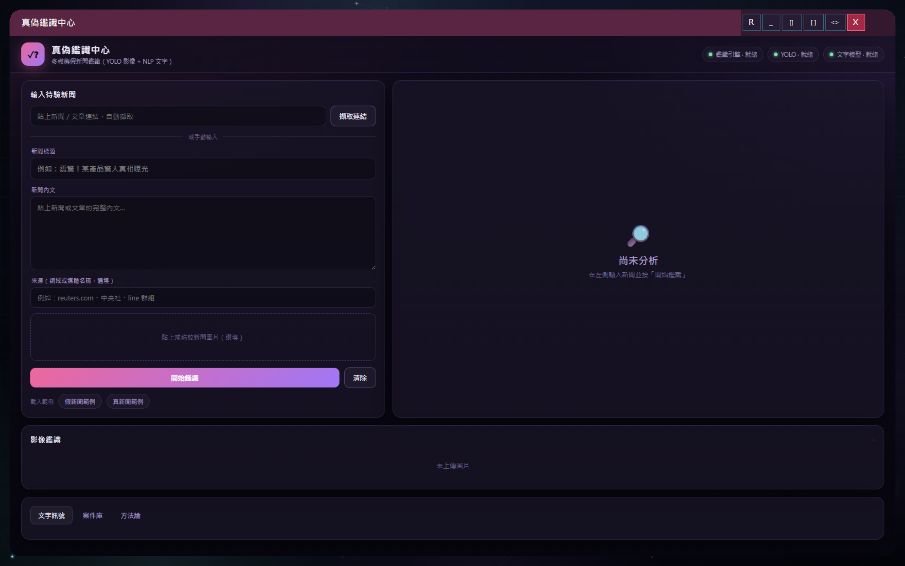

# Fusion OS 專案說明（1113354 陳冠瑋）

## 一、專案簡介

這個專案是一個用 **C# Windows Forms** 當作外殼、再用 **WebView2 內嵌 React 前端** 打造出來的「擬桌面作業系統」——我把它取名叫 **Fusion OS**。

一開始我只是想做一個比較好看的視窗程式，後來愈做愈大，變成一個有開機動畫、登入帳號、空間感桌面、應用程式中心（App Center）、語音助理、手勢操控、桌面寵物的完整桌面環境，裡面再整合 **25 個以上我自己做的應用程式**，每一個 App 都各自是一個小專案，橫跨 3D 繪圖、電腦視覺、AI／大型語言模型、語音辨識、物聯網、地圖、金融、音樂等不同領域。

整體架構大致是這樣：

- **C# Windows Forms 主程式（殼層）**：負責視窗、無邊框玻璃擬態桌面、WebView2 內嵌、Win32 視窗操作、外部程序啟動與生命週期管理、SQLite 帳號系統。
- **React + TypeScript 前端**：整個桌面 UI、應用程式中心、以及大部分「在殼層內開啟」的應用頁面（電路、開發實驗室、詩雲、NeuroFlow、體育中心、法律導航……）。
- **整合式子程式**：用 Python（FinWeb、語音服務、地圖後端…）、C++（物聯網引擎、交通路網引擎）、Unity 6（櫻花校園 RPG）、以及幾個 C# 視窗工具（鋼琴、影音、音訊、單字卡）寫成，由主程式在需要時啟動。

內建的主要應用（部分）：

- 電路工作室（DC 電路模擬）、開發實驗室（資料結構與演算法視覺化）、工具箱（工程數學等 11 種工具）、Fusion 資料庫（瀏覽器內 SQL）
- 虛擬造型工作室（彩妝／試衣間，臉部與姿態辨識）、詩雲（3D 古典詩詞宇宙）、世界文化星球（3D 地球 + 鳥類星球）、宇宙手勢（WebGL 手勢）
- NeuroFlow AI（LLM 推論流程模擬）、SignalForge（通訊與處理器）、MediSphere（健康行動）、LexTaiwan 法律導航
- 全球體育中心（即時比分 + 蒙地卡羅預測）、FinWeb（AI 投資與市場情報）、MetroPulse 智慧交通、物聯網中樞、真偽鑑識中心（多模態假新聞偵測）
- 鋼琴工作室、AURORA 影音中心、音訊工作室、英文單字卡、Fusion RPG（Unity 動作遊戲）、記事本與日曆

> 補充：完整的技術盤點另外整理成三份 Word 檔（依頁面 / 全部技術 / 程式語言），放在內層專案資料夾，可搭配本說明一起看。

---

## 二、開發動機

我想挑戰看看能不能用一個程式，把我這學期（還有之前修過的課）學到的東西全部整合在一起：影像處理、電腦視覺、3D 繪圖、AI、網路、資料庫、作業系統概念……

與其分別交很多個小程式，我選擇做一個「桌面作業系統」當容器，把每個主題都做成裡面的一個 App。這樣不只練到單一技術，也練到比較難的部分：**怎麼把 C#、Web、Python、C++、Unity 這些不同環境整合在同一個程式裡，並且讓它們互相溝通、依序啟動。**

---

## 三、系統需求與環境

最低需求（只要跑基本桌面與大部分前端 App）：

- Windows 10 / 11（64 位元）
- Visual Studio 2022
- .NET Framework 4.7.2
- Microsoft Edge WebView2 Runtime（Windows 11 通常已內建）

進階需求（要跑前端開發模式或部分整合 App）：

- Node.js 18+ 與 npm（前端 React / Vite）
- Python 3.10（FinWeb、語音服務、地圖／物聯網／鑑識等後端）
- （選用）Unity 6（6000.0.32f1）——只有要打開 Fusion RPG 原始專案時才需要
- （選用）C++17 編譯器——只有要重新編譯物聯網 / 交通引擎時才需要

---

## 四、執行說明

### 方式 A：最簡單——直接用 Visual Studio 執行

1. 用 Visual Studio 開啟最外層的方案檔 `WindowsFormsApp1.slnx`。
2. 還原 NuGet 套件（第一次開啟通常會自動還原）。
3. 按「建置」→「F5 開始執行」。
4. 程式會先播放開機動畫，再進入登入畫面。第一次使用請建立一個帳號（名稱 + 密碼），帳號資料存在本機 SQLite，不會上傳。
5. 進入桌面後，從下方程式塢或「應用程式中心」就能開啟各個 App。

> 前端 React UI 我已經事先 build 進 `WindowsFormsApp1/dist`，主程式啟動時會直接載入，所以**只跑桌面的話不需要另外安裝 Node 或 Python**。

### 方式 B：前端開發模式（要改 React UI 時）

```powershell
cd WindowsFormsApp1\Frontend
npm install
npm run dev      # 開發伺服器，預設 http://localhost:5173
# 或
npm run build    # 重新打包輸出到 ..\dist，主程式才會吃到變更
```

在瀏覽器預覽時可加上 `?boot=0` 跳過開機動畫，方便除錯。

### 方式 C：啟用需要後端的整合 App

有些 App 是獨立的子程式，會在你點開時由主程式啟動；第一次使用前請先安裝對應套件：

- **FinWeb（AI 投資情報）**：
  ```powershell
  cd WindowsFormsApp1\IntegratedApps\FinWeb
  python -m pip install -r requirements.txt
  ```
  之後在桌面點 FinWeb 即可，主程式會自動在背景啟動 Flask 服務（首次載入約需 10 秒暖機）。
- **語音助理 AI 模式 / fusion_voice**：需安裝 `fusion_voice/requirements.txt`，並（選用）安裝 Ollama 跑本機 Gemma 模型。
- **MetroPulse、物聯網中樞、真偽鑑識中心、世界文化星球** 等：各自有 Python 需求或預先編好的原生引擎，點開時若缺少環境，程式會跳出提示。

> 若助教只想看主要桌面與前端應用，用「方式 A」即可；需要後端的 App 沒安裝環境時不會影響其他功能。

---

## 五、系統畫面截圖

> 下面的圖片放在 `./screenshots/` 資料夾，請把對應畫面的截圖存成同名 PNG 即可顯示。

### 1. 開機動畫


說明：啟動時的程序化極光與粒子開機畫面。

### 2. 登入畫面


說明：SQLite 多使用者登入，可建立新帳號、切換五種語言。

### 3. 桌面主畫面


說明：空間感桌面，含左側導覽、中央能量核心、執行中應用程式輪播、右側小工具、下方程式塢與桌面寵物。

### 4. 應用程式中心


說明：所有 App 的統一入口，可分類瀏覽、搜尋、查看最近使用。

### 5. 代表性應用（3D／視覺）


說明：放詩雲（3D 詩詞宇宙）或世界文化星球（3D 地球 / 鳥類星球）的畫面。

### 6. 代表性應用（AI／資料）


說明：放 NeuroFlow AI 推論流程，或真偽鑑識中心的多模態分析畫面。

### 7. 代表性應用（工程／工具）


說明：放電路工作室（即時電路模擬）或開發實驗室（演算法視覺化）的畫面。

> 想多放幾張也可以，依照 `screenshots/` 裡的命名自由增加並在這裡補上 `` 即可。

---

## 六、主要功能整理

- **桌面殼層**：開機動畫、SQLite 登入、空間桌面、應用程式中心、五語 i18n、自適應效能分級、桌面寵物。
- **互動方式**：滑鼠、鍵盤、MediaPipe 手勢操控、語音助理（喚醒詞 / 離線 NLU / 可選 LLM）。
- **創作類**：詩雲、世界文化星球、宇宙手勢、虛擬造型工作室。
- **工程／資料類**：電路工作室、開發實驗室、工具箱、Fusion 資料庫、SignalForge、MetroPulse、物聯網中樞。
- **AI 類**：NeuroFlow AI、真偽鑑識中心、FinWeb、全球體育中心、MediSphere、LexTaiwan。
- **媒體 / 遊戲**：鋼琴工作室、AURORA 影音中心、音訊工作室、英文單字卡、Fusion RPG。
- **生產力**：記事本與日曆（可由語音助理新增提醒）。

---

## 七、專案結構

```text
WindowsFormsApp1/                ← 最外層（方案 / repo 根；改名後 = 1113354_陳冠瑋）
├─ WindowsFormsApp1.slnx         ← Visual Studio 方案檔
├─ README.md                     ← 本說明
├─ screenshots/                  ← 系統畫面截圖
└─ WindowsFormsApp1/             ← C# 專案本體
   ├─ Form1.cs                   ← 主程式（殼層、WebView2、各 App 啟動）
   ├─ WindowsFormsApp1.csproj
   ├─ Frontend/                  ← React + TypeScript 前端原始碼
   ├─ dist/                      ← 前端打包輸出（主程式載入這個）
   └─ IntegratedApps/            ← 各整合應用（Python / C++ / Unity / C#）
      ├─ FinWeb/  CosmicGesture/  CulturaGlobe/  IoTNexus/
      ├─ MetroPulse/  VeriLens/  PianoStudio/  WaveStudio/
      ├─ MultimediaStudio/  EnglishFlashcards/  FusionRPG/ ...
```

---

## 八、技術說明（重點）

- **混合式架構**：C# WinForms 殼層 + Edge WebView2 內嵌 Chromium；JavaScript ↔ .NET 透過 WebMessage 雙向溝通；本機優先（SQLite / localStorage / 離線 fallback）。
- **3D / 繪圖**：Three.js、React Three Fiber、自訂 GLSL shader、Bloom、程序化 noise / fBm、InstancedMesh 紋理圖集。
- **電腦視覺**：MediaPipe（手部 / 臉部 / 姿態）、YOLOv8（ONNX）、OpenCV（ELA / ORB copy-move）、rembg + U²-Net 去背。
- **AI / LLM**：scikit-learn、Prophet、Gemma（Transformers / 量化）、Ollama、Gemini / OpenAI、Faster-Whisper 語音辨識。
- **網路 / 系統**：自實作 MQTT broker 與 WebSocket、C++17 數位孿生 / 交通路網引擎、Win32 P/Invoke、多程序協調。
- **安全**：PBKDF2 / Argon2 密碼雜湊、TOTP 兩步驗證、Fernet 加密、固定時間比較。

（完整清單請見內層專案的三份「Fusion OS 技術盤點」Word 檔。）

---

## 九、存讀檔功能

專案有多種存讀檔：

- C# 視窗應用（鋼琴 / 音訊 / 影音 / 單字卡）用 `OpenFileDialog` / `SaveFileDialog` 實際讀寫 `.mid`、`.wav`、`.json`、字幕、播放清單等檔案。
- 前端「電路工作室」有完整的 **儲存 / 載入 / 匯入 .json / 匯出 .json + 自動儲存**；虛擬造型可上傳照片、匯出造型；工具箱小畫家可存 PNG。
- 設定、帳號、記事本 / 日曆、最近使用等狀態會自動存於 localStorage / SQLite。

---

## 十、目前限制與備註

1. 部分 AI / 後端 App（FinWeb、語音、地圖、鑑識）需要 Python 與額外套件，沒安裝時該 App 會提示，但不影響其他功能。
2. 一些 3D 效果在不同顯示卡上表現略有差異；程式會依裝置效能自動分級降載。
3. 外部大型工具 / 模型（Audiveris、FFmpeg、Ollama 模型等）採「需要時再安裝」，避免繳交壓縮檔過大。
4. 帳號與資料皆存在本機，不會上傳雲端。

---

> 本專案為個人期末整合專題，從一個視窗程式逐步擴充成整個桌面環境與多領域應用的整合，過程中最大的收穫是學會把不同語言、不同執行環境的程式整合成一個能互相溝通、穩定運作的系統。
