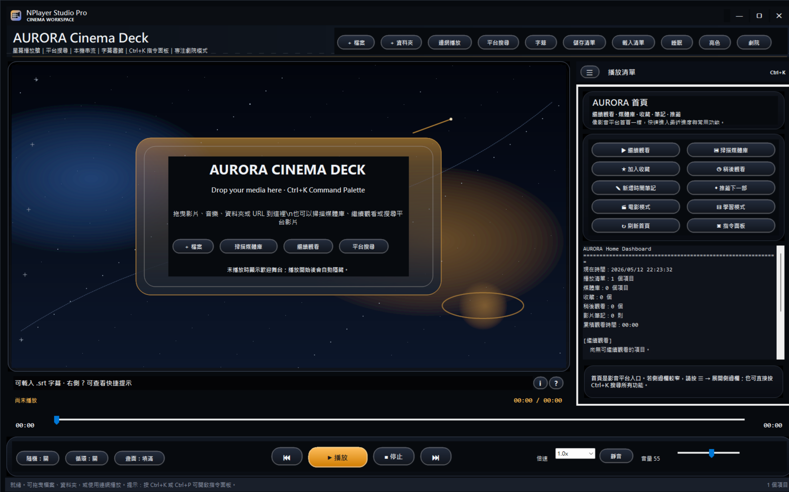
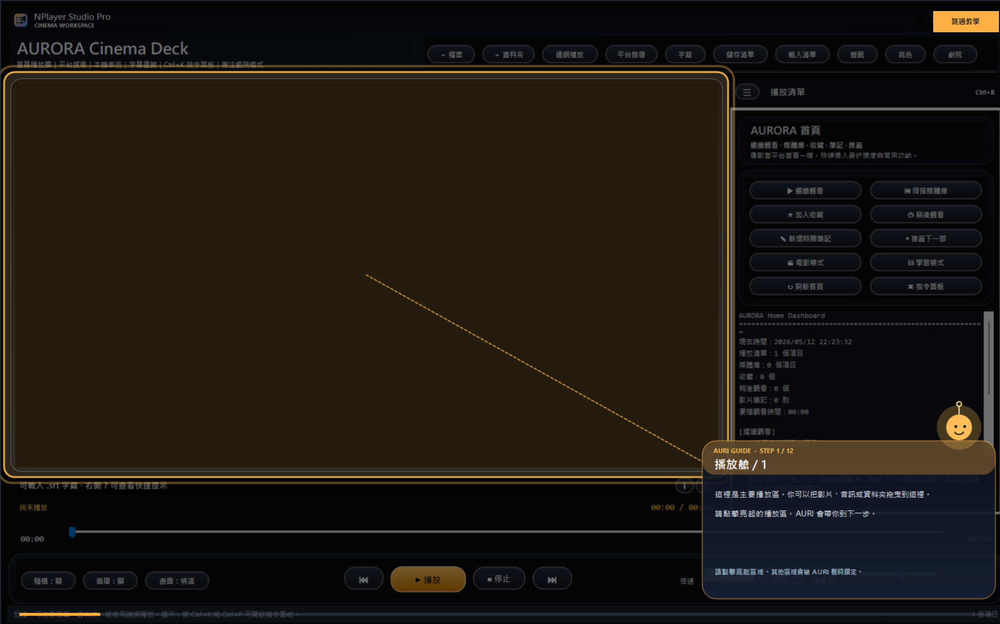
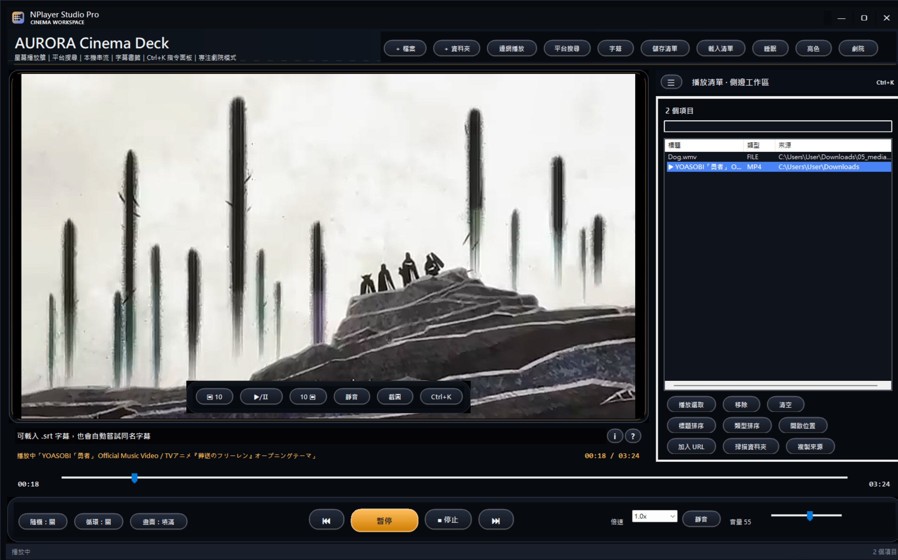
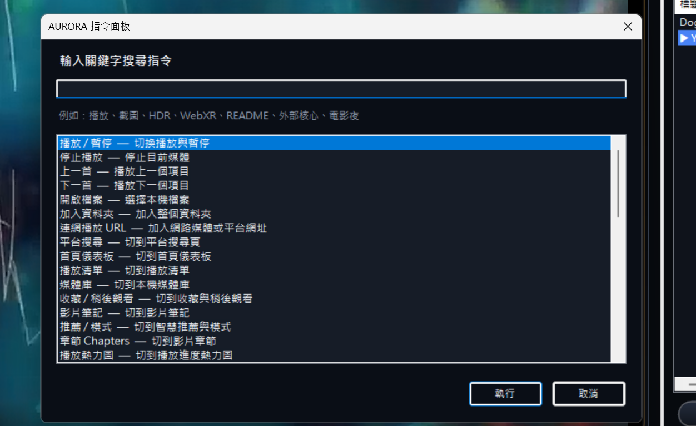
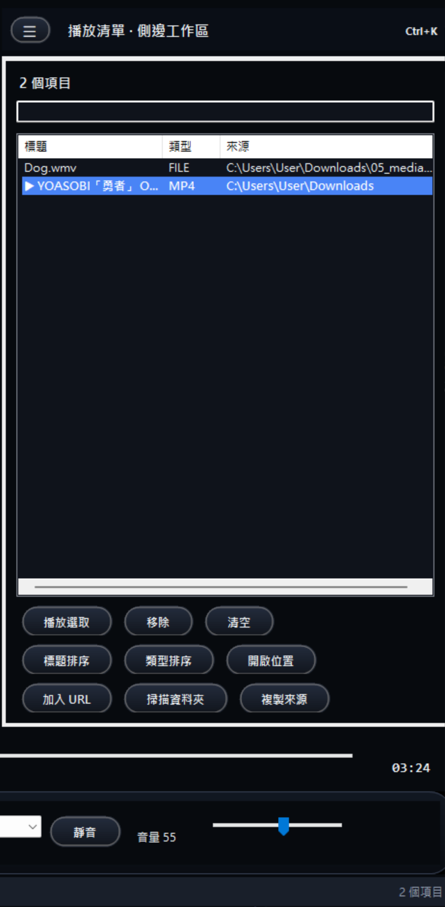
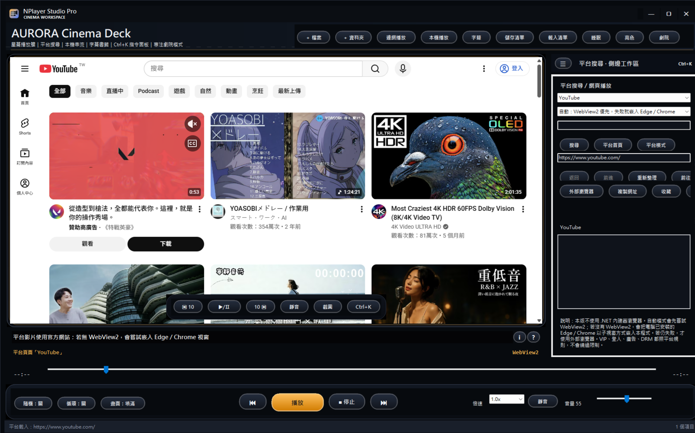
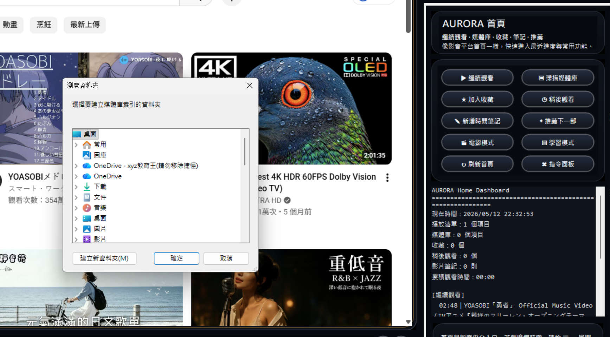
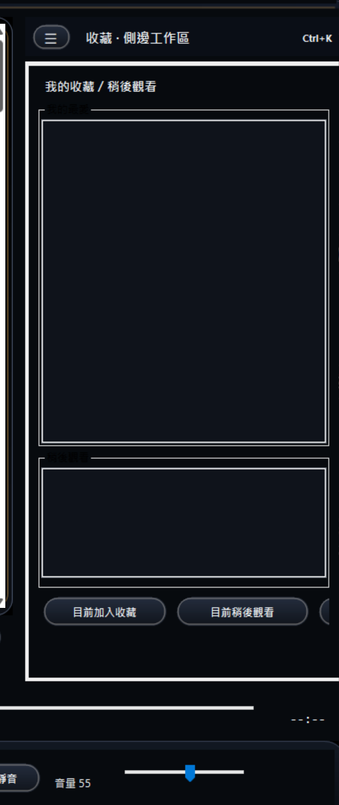
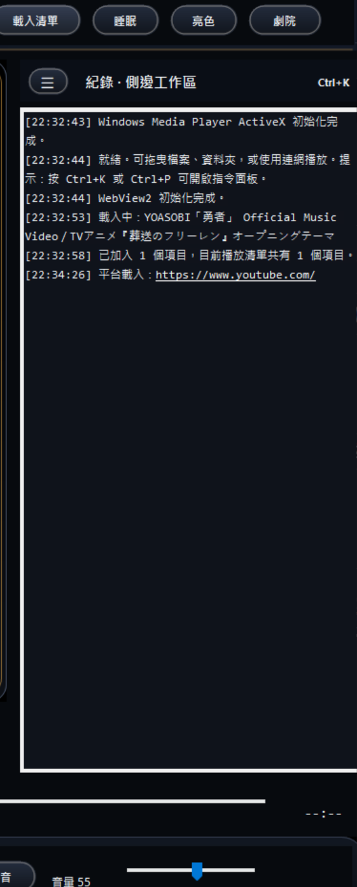

# AURORA Cinema Deck 多媒體播放器

> 我把這個專案設計成一個偏「劇院級影音中心」的 Windows Forms 多媒體播放器。  
> 它不只是基本播放影片，而是整合了本機播放、平台搜尋、播放清單、字幕、書籤、AB 重複、外部核心偵測、指令面板、媒體庫、收藏、影片筆記、繼續觀看與互動式教學導覽。

---

## 一、專案簡介

這是我使用 **C# Windows Forms** 製作的多媒體播放器。  
一開始我只是想完成基本的影片播放、暫停、停止與開檔功能，但後來我希望它不只是「能播影片」，而是更像一個完整的影音平台，所以我把 UI 與功能都往產品化方向設計。

這個播放器的核心概念是：

- 本機影片可以播放與管理。
- 網路平台可以搜尋與開啟。
- 使用者可以建立自己的播放清單、收藏、稍後觀看與媒體庫。
- 程式會盡量自動偵測可用的外部核心。
- 沒有額外套件時，也不會讓基本功能壞掉。
- 整體 UI 採用暗色劇院風格，並加入小精靈導覽、浮出提示卡與指令面板。

---

## 二、主要特色

### 1. 本機多媒體播放

我使用 Windows Media Player ActiveX 作為主要播放核心，因此可以播放電腦本身支援的常見影音格式，例如：

- WMV
- MP4
- AVI
- MOV
- MKV
- MP3
- WAV
- WMA

實際可播放格式會依照電腦上的解碼器支援程度而定。

---

### 2. 播放清單管理

我加入了播放清單功能，可以管理多個本機檔案或 URL。

支援功能包含：

- 加入檔案
- 加入資料夾
- 加入 URL
- 播放選取
- 移除選取
- 清空播放清單
- 標題排序
- 類型排序
- 開啟檔案位置
- 搜尋播放清單
- 複製來源路徑

---

### 3. 平台搜尋與網頁播放

我希望播放器也能有類似 YouTube、bilibili、愛奇藝等平台入口，因此加入了平台搜尋與網頁播放功能。

目前設計支援的平台入口包含：

- YouTube
- Bilibili
- 愛奇藝
- Twitch
- Vimeo
- TikTok
- 巴哈動畫瘋

平台播放採用 Hybrid 架構：

1. 優先使用 WebView2。
2. 若 WebView2 不可用，嘗試使用 Edge / Chrome / Brave 嵌入。
3. 若仍不可用，則使用外部瀏覽器開啟。

這樣可以避免因為助教電腦缺少某個元件，就導致整個程式不能使用。

---

### 4. 外部核心自動偵測

我沒有把 FFmpeg、VLC、CefSharp 或完整 WebView2 Runtime 直接打包進專案，因為這些元件檔案很大，可能會超過作業限制。

我改成 Optional Engine 架構：

- 有偵測到就顯示可用。
- 沒偵測到就自動降級。
- 不會影響基本播放器功能。

目前會偵測：

- WebView2 SDK / NuGet
- WebView2 Runtime
- Edge / Chrome / Brave
- FFmpeg
- FFprobe
- VLC
- CefSharp

---

### 5. Ctrl+K 指令面板

我加入了類似 VS Code、Notion 那種指令面板。

按下：

```text
Ctrl + K
```

或：

```text
Ctrl + P
```

就可以開啟指令面板，直接搜尋功能並執行。

可以搜尋的功能包含：

- 播放 / 暫停
- 停止
- 上一首 / 下一首
- 開啟檔案
- 加入資料夾
- 加入 URL
- 平台搜尋
- 播放清單
- 媒體庫
- 收藏
- 影片筆記
- 推薦 / 模式
- 外部核心偵測
- 展示中心
- 沉浸影音
- 工作階段快照
- 字幕樣式
- 重播小精靈導覽

這個功能是我覺得最像「產品級軟體」的地方，因為功能很多時，不需要一直找按鈕，直接搜尋就能操作。

---

### 6. AURI 小精靈引導式教學

我加入了一個互動式教學導覽，命名為 **AURI**。

第一次啟動程式時，AURI 會用 Overlay 方式引導使用者操作：

- 顯示目前步驟
- 高亮要點擊的區域
- 其他區域暫時鎖定
- 點對地方才會進下一步
- 可以一鍵跳過教學
- 最後會顯示「我了解了，開始使用」

導覽內容包含：

1. 播放區
2. 播放按鈕
3. 進度列
4. 音量控制
5. 右側側邊工作區
6. 播放清單
7. 平台搜尋
8. 沉浸影音
9. 外部核心偵測
10. Ctrl+K 指令面板
11. 展示中心
12. 開始使用

---

### 7. 首頁 Dashboard

我新增了一個首頁儀表板，讓播放器看起來更像影音平台入口。

首頁會顯示：

- 播放清單數量
- 媒體庫數量
- 收藏數量
- 稍後觀看數量
- 影片筆記數量
- 累積觀看時間
- 繼續觀看項目
- 展示建議流程

首頁也提供快速入口：

- 繼續觀看
- 掃描媒體庫
- 加入收藏
- 稍後觀看
- 新增時間筆記
- 推薦下一部
- 電影模式
- 學習模式
- 刷新首頁
- 指令面板

---

### 8. 本機媒體庫

我加入媒體庫功能，可以掃描資料夾並建立本機影音索引。

支援：

- 掃描資料夾
- 搜尋媒體庫
- 播放選取
- 加入播放清單
- 加入收藏
- 加入稍後觀看
- 開啟來源位置
- 清空媒體庫索引

這個功能的設計方向類似 Plex 或 Jellyfin 的本機媒體中心，但不需要額外伺服器。

---

### 9. 收藏與稍後觀看

除了播放清單，我也加入了更像影音平台的分類：

- 我的最愛
- 稍後觀看

使用者可以把目前播放中的影片或媒體庫項目加入收藏，也可以加入稍後觀看。

這些資料會儲存在使用者資料夾，下次開啟程式仍會保留。

---

### 10. 繼續觀看

我加入了 Resume Watching 功能。

當使用者播放影片時，程式會自動記錄播放進度。  
下次播放同一個影片時，會詢問：

```text
上次看到 00:12:35，是否從此位置繼續觀看？
```

這個功能讓播放器更接近 Netflix、YouTube 那種使用體驗。

---

### 11. 影片時間軸筆記

我加入了影片筆記功能，可以在某個時間點寫下註解。

例如：

```text
00:01:25 這裡可以展示字幕功能
00:03:10 這段適合測試 AB 重複
00:05:40 這裡有轉場
```

功能包含：

- 新增目前時間筆記
- 點筆記跳到指定時間
- 只看目前影片筆記
- 顯示全部筆記
- 刪除筆記
- 匯出影片筆記

這個功能可以讓播放器變成影音學習或影片標註工具。

---

### 12. 智慧推薦與觀看模式

我加入了推薦頁面與觀看模式。

推薦邏輯包含：

- 還沒看完的影片
- 同資料夾影片
- 稍後觀看
- 媒體庫項目
- 播放清單項目

觀看模式包含：

#### 電影模式

- 深色介面
- 音量調整
- 側邊欄精簡
- 適合觀影

#### 學習模式

- 字幕放大
- 單首循環
- 切到影片筆記頁
- 適合看教學影片

#### 音樂模式

- 隨機播放
- 全部循環
- 適合播放音樂清單

#### 展示模式

- 視窗置頂
- 切到展示中心
- 適合交作業展示

---

### 13. 字幕與字幕樣式

我加入了 `.srt` 字幕支援，並會自動嘗試載入同名字幕。

也提供字幕樣式編輯器：

- 字幕大小
- 粗體 / 一般 / 斜體 / 粗斜體
- 白字 / 金字 / 青字
- 黑底 / 透明底
- 字幕列高度
- 字幕預覽

---

### 14. 書籤與 AB 重複

我加入了影片書籤與 AB 重複功能。

可以：

- 在目前時間點加入書籤
- 點書籤跳轉
- 設定 A 點
- 設定 B 點
- 啟用 AB 重複
- 清除 AB 區間

這對學習影片、語言學習或反覆觀看特定片段很有用。

---

### 15. 浮動迷你控制列

我加入了浮動控制列，滑鼠移到播放區時會出現。

包含：

- 快退 10 秒
- 播放 / 暫停
- 快轉 10 秒
- 靜音
- 截圖
- Ctrl+K 指令面板
- 劇院模式

這個設計比較接近 YouTube 或 Netflix 的控制列。

---

### 16. 劇院風格 UI

整體介面採用暗色劇院風格，包含：

- 自訂標題列
- 圓角按鈕
- 金色高亮
- 深色卡片
- 浮出式提示卡
- Toast 通知
- 玻璃感資訊卡
- 自訂劇院風格提示框

我也把原本系統 MessageBox 的突兀感降低，改成比較符合播放器風格的提示系統。

---

### 17. 浮出式說明卡

我把原本很大的提示文字改成右側小 icon。

字幕列右側有兩個按鈕：

- `?`：快捷教學
- `i`：播放器狀態

滑鼠移上去或點擊後會出現浮出式說明卡，不會佔用整個畫面。

---

### 18. 展示中心

展示中心是我特別為交作業設計的頁面。

包含：

- 產生展示摘要
- 匯出 README
- 複製 README
- 繳交檢查
- 播放清單分析
- 重複項目掃描
- 展示台詞
- 快捷鍵總覽
- 21MB 打包提醒

這樣展示時可以很快說明我做了哪些功能。

---

## 三、快捷鍵

| 快捷鍵 | 功能 |
|---|---|
| Ctrl + K | 開啟指令面板 |
| Ctrl + P | 開啟指令面板 |
| Space | 播放 / 暫停 |
| ← | 快退 |
| → | 快轉 |
| ↑ | 音量增加 |
| ↓ | 音量降低 |
| M | 靜音 |
| T | 視窗置頂 |
| F11 | 劇院模式 |
| Esc | 離開劇院模式 |
| Ctrl + O | 開啟檔案 |
| Ctrl + U | 加入 URL |
| Ctrl + J | 跳到指定時間 |
| Ctrl + S | 畫面截圖 |

---

## 四、環境需求

我主要使用以下環境開發：

- Visual Studio
- C#
- Windows Forms
- .NET Framework
- Windows Media Player ActiveX

需要加入的參考：

- Windows Media Player COM 元件
- `AxWMPLib`
- `WMPLib`

若要使用 WebView2 相關功能，建議安裝：

```powershell
Install-Package Microsoft.Web.WebView2
```

如果是一般電腦執行，建議安裝 WebView2 Runtime：

```powershell
winget install -e --id Microsoft.EdgeWebView2Runtime
```

不過 WebView2 不是基本播放必需項目。  
如果沒有 WebView2，程式會嘗試使用 Edge / Chrome / Brave 或外部瀏覽器備援。

---

## 五、選配外部工具

以下工具不是必要，但若電腦有安裝，程式會自動偵測：

### FFmpeg

```powershell
winget install -e --id Gyan.FFmpeg
```

### VLC

```powershell
winget install -e --id VideoLAN.VLC
```

### Chrome

```powershell
winget install -e --id Google.Chrome
```

我沒有把這些工具直接打包進專案，因為它們檔案較大，可能會超過繳交限制。

---

## 六、21MB 繳交策略

因為作業有解壓縮後大小限制，所以我採用 Optional Engine 架構。

我不把以下大型項目直接放進壓縮檔：

- bin
- obj
- .vs
- packages
- FFmpeg
- VLC
- CefSharp
- 完整 WebView2 Runtime
- 大型測試影片

我只繳交原始碼與必要專案檔。  
進階功能如果偵測不到外部核心，就會自動降級，不影響基本功能。

---

## 七、建議展示流程

我展示時會照這個順序：

1. 開啟程式，展示 AURI 小精靈導覽。
2. 播放本機影片，展示播放、暫停、停止與進度列。
3. 按 Ctrl+K，展示指令面板。
4. 加入資料夾，展示播放清單與媒體庫。
5. 停止影片後重新播放，展示繼續觀看。
6. 新增影片時間軸筆記，展示點筆記跳轉。
7. 切換字幕樣式，展示字幕 UI。
8. 展示平台搜尋與 WebView2 / Edge / Chrome 備援。
9. 展示外部核心偵測。
10. 展示沉浸影音中的 HDR / Dolby Vision / AR / VR 入口。
11. 展示首頁 Dashboard、收藏、稍後觀看與推薦模式。
12. 最後展示展示中心與 README 匯出。

---

## 八、我覺得這個專案的重點

我覺得這個專案最主要的重點不是只有「影片能不能播」，而是我把一個基本播放器慢慢擴充成完整的影音中心。

我特別重視幾件事：

- 功能要完整。
- 介面要像產品。
- 助教第一次打開也知道怎麼操作。
- 沒有套件時不能整個壞掉。
- 不能因為加功能就超過檔案大小限制。
- 進階功能要有說明與備援。

所以我最後採用的方向是：

```text
基本功能穩定可用
進階功能自動偵測
UI 盡量產品化
檔案大小保持可繳交
```

---

---

## 九、截圖展示區

### 1. 首頁 Dashboard



我可以在這裡放首頁儀表板的畫面，展示繼續觀看、媒體庫、收藏、稍後觀看、筆記與推薦入口。

---

### 2. AURI 小精靈引導式教學



我可以在這裡放首次啟動導覽的畫面，展示小精靈如何高亮指定區域並引導操作。

---

### 3. 本機影片播放畫面



我可以在這裡放影片播放中的畫面，展示劇院風格 UI、播放區、進度列、音量與控制列。

---

### 4. Ctrl+K 指令面板



我可以在這裡放指令面板畫面，展示如何搜尋播放、截圖、外部核心、展示中心、沉浸影音等功能。

---

### 5. 播放清單與側邊工作區



我可以在這裡放右側工作區的畫面，展示播放清單、搜尋、排序、移除與開啟位置等功能。

---

### 6. 平台搜尋與網頁播放



我可以在這裡放 YouTube、Bilibili 或其他平台搜尋畫面，展示平台入口與 WebView2 / Edge / Chrome 備援設計。

---

### 7. 媒體庫掃描



我可以在這裡放媒體庫頁面，展示掃描資料夾、搜尋本機媒體、加入播放清單與播放選取。

---

### 8. 收藏與稍後觀看



我可以在這裡放收藏頁面，展示我的最愛、稍後觀看、播放選取與移除項目。

---

### 9. 影片時間軸筆記



我可以在這裡放影片筆記頁面，展示在指定時間點新增筆記，以及點擊筆記跳轉到影片時間。

---

## 十、截圖檔案命名建議

我會建議截圖依照下面方式命名，這樣 README 裡的圖片連結可以直接對應：

```text
screenshots/
├── 01_home_dashboard.png
├── 02_auri_tutorial.png
├── 03_local_playback.png
├── 04_command_palette.png
├── 05_playlist_sidebar.png
├── 06_platform_search.png
├── 07_media_library.png
├── 08_collections.png
├── 09_video_notes.png
```

## 十一、專案總結

這個播放器最後整合了：

- 本機播放
- 平台搜尋
- 播放清單
- 媒體庫
- 收藏
- 稍後觀看
- 繼續觀看
- 影片筆記
- 智慧推薦
- 字幕
- 字幕樣式
- 書籤
- AB 重複
- 睡眠計時
- 劇院模式
- 指令面板
- 外部核心偵測
- 浮動控制列
- 小精靈教學
- 展示中心
- README 匯出
- 21MB 打包策略

我希望它看起來不像一般課堂範例，而是比較接近一個完整影音平台的雛形。
