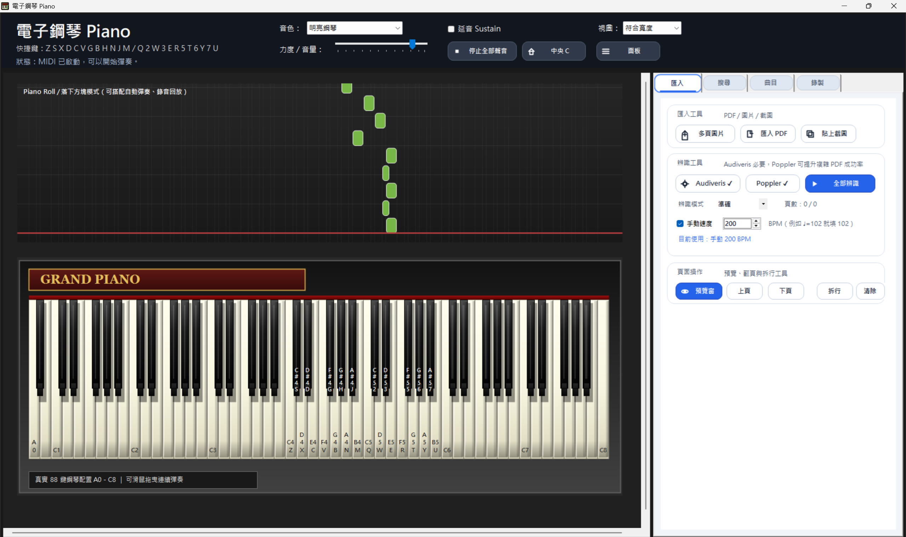
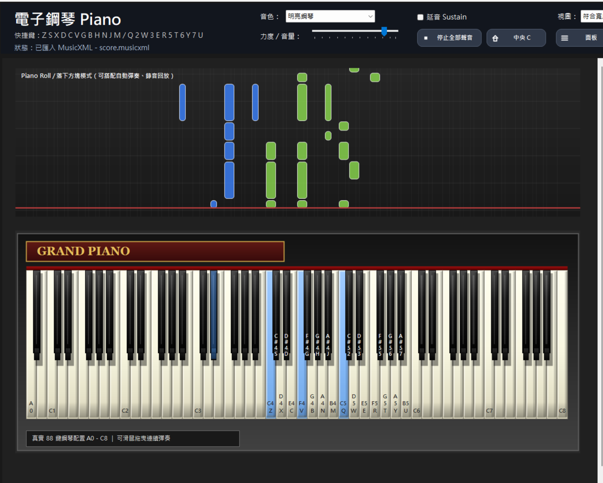
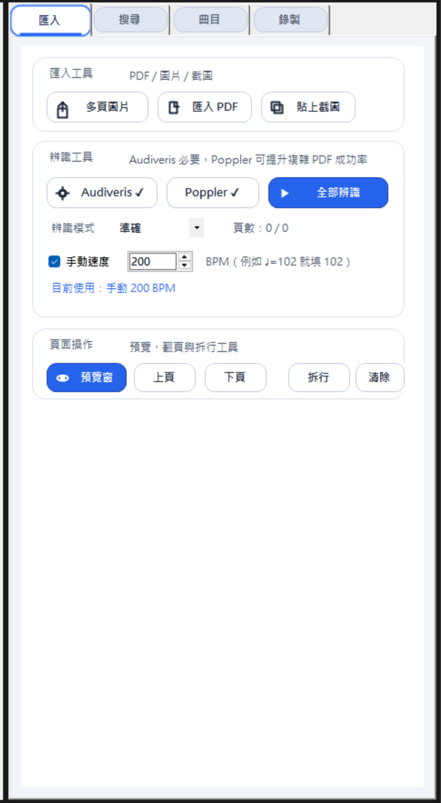
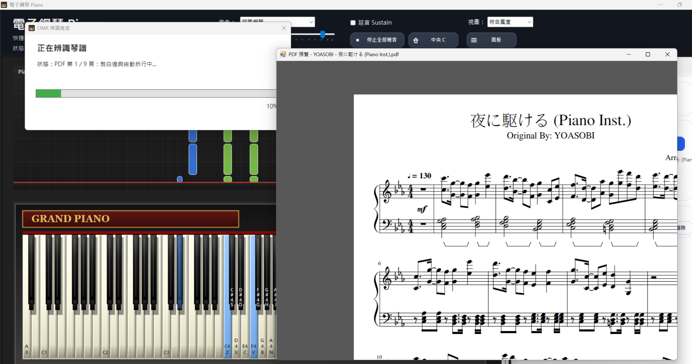
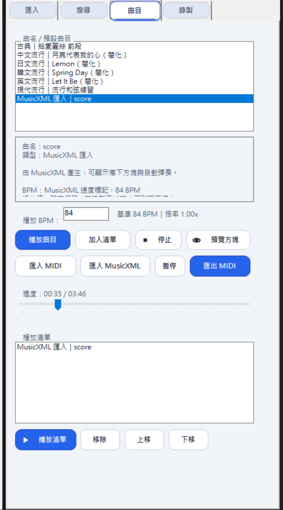
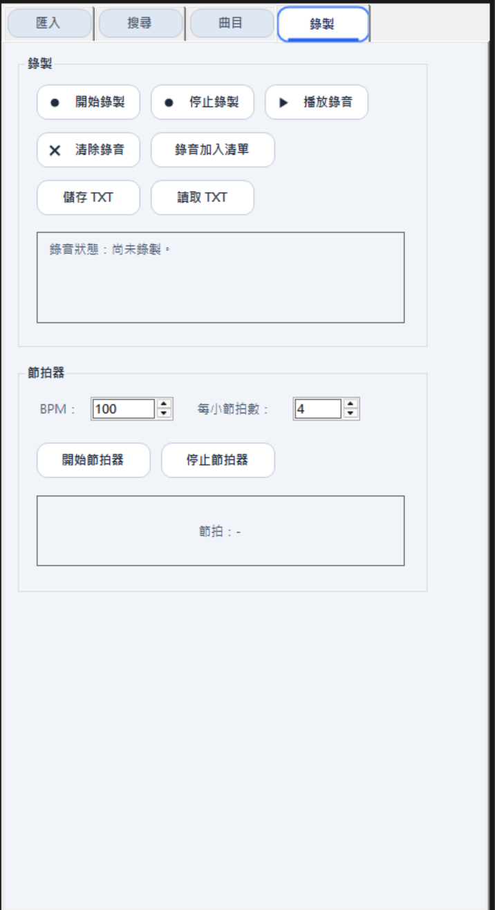
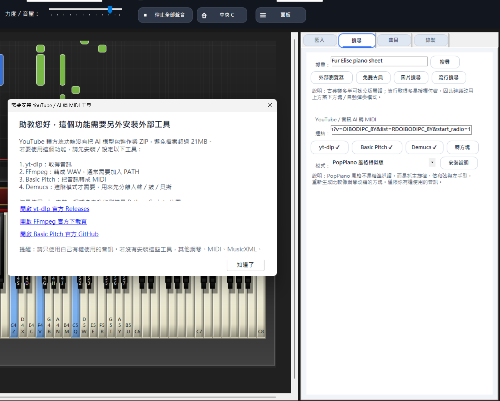

# 電子鋼琴 Piano 專案說明

## 一、專案簡介

這個專案是一個使用 **C# Windows Forms** 製作的電子鋼琴與鋼琴視覺化播放工具。  
一開始我只是想做一個可以用電腦鍵盤按出聲音的簡單電子琴，後來慢慢把它擴充成可以匯入琴譜、播放 MIDI、顯示落下方塊、錄製演奏、辨識樂譜與進行 AI 音訊轉 MIDI 的整合型工具。

目前程式支援：

- 真實感 88 鍵鋼琴鍵盤
- 電腦鍵盤彈奏
- Piano Roll 落下方塊
- 自動播放與可拖曳播放進度
- MIDI 匯入與匯出
- MusicXML 匯入
- PDF / 圖片 / 截圖琴譜匯入
- OMR 光學樂譜辨識
- 錄製與播放清單
- 節拍器
- 手動 BPM 控制
- YouTube / 音訊 AI 轉 MIDI
- 類似 PopPiano 的相似鋼琴編曲模式

我希望它不只是「按鍵會發出聲音」的電子琴，而是一個可以把琴譜、MIDI、MusicXML，甚至音訊來源，轉成可視化落下方塊並播放的練習工具。

---

## 二、開發動機

我本身對 Synthesia、Piano Roll 類型的鋼琴視覺化播放方式很有興趣。  
這種介面可以直接看到音符什麼時候落下、什麼時候按鍵，對初學者來說比單純看五線譜更直覺。

另外，我在大三修過「影像處理概論」，所以這次也想把課程中接觸到的影像前處理概念用在專案中。  
因此我加入了 PDF / 圖片 / 截圖琴譜辨識流程，例如：

- PDF 轉圖片
- 截圖貼上
- 裁切白邊
- 放大解析度
- 黑白化處理
- 雙頁拆分
- 自動拆行
- OMR 辨識
- MusicXML 解析
- 轉成落下方塊與自動播放

後來我也嘗試加入 AI 音訊轉 MIDI 與類似 PopPiano 的鋼琴改編概念。  
這個部分不是精準還原原曲，而是比較像「抓主旋律、估和弦、重新整理成鋼琴可播放版本」。

---

## 三、系統畫面截圖

### 1. 主畫面



說明：  
主畫面包含上方控制列、Piano Roll 落下方塊、88 鍵鋼琴鍵盤與右側功能面板。

---

### 2. 鋼琴鍵盤與落下方塊



說明：  
自動播放時，音符方塊會從上方落下，碰到紅線時觸發音符，鋼琴鍵也會同步亮起。

---

### 3. 琴譜匯入畫面



說明：  
這裡可以放匯入 PDF、圖片或貼上截圖後的畫面。

---

### 4. OMR 辨識進度畫面



說明：  
這裡可以放按下「全部辨識」後，顯示目前頁數、處理步驟與進度條的畫面。

---

### 5. 曲目與播放清單畫面



說明：  
這裡可以放預設曲目、匯入 MIDI / MusicXML、BPM 控制、播放清單與匯出 MIDI 的操作畫面。

---

### 6. 錄製與節拍器畫面



說明：  
這裡可以放錄製演奏、播放錄音與節拍器功能的畫面。

---

### 7. YouTube / AI 轉 MIDI 畫面



說明：  
這裡可以放貼上 YouTube 連結、選擇 AI 模式、轉換進度與產生落下方塊的畫面。

---

## 四、助教可測試檔案

我有預留一個 `demo_files` 資料夾，裡面可以放助教測試用的檔案。  
如果檔案大小不大，可以直接放進專案資料夾一起繳交；如果影片太大，建議放雲端連結，避免壓縮檔超過限制。


### 1. 測試用 PDF 樂譜

[開啟測試 PDF 樂譜1](./demo_files/sample_score1.pdf)
[開啟測試 PDF 樂譜2](./demo_files/sample_score2.pdf)
[開啟測試 PDF 樂譜3](./demo_files/sample_score3.pdf)
用途：

- 測試「匯入 PDF」
- 測試「全部辨識」
- 測試 OMR 轉 MusicXML
- 測試辨識後播放落下方塊

---

### 2. 測試用 MusicXML

[開啟測試 MusicXML1](./demo_files/sample_musicxml.musicxml)
[開啟測試 MusicXML2](./demo_files/sample_musicxml1.musicxml)

用途：

- 測試「匯入 MusicXML」
- 測試 MusicXML 轉落下方塊
- 測試 BPM 與休止符解析

---

### 3. 測試用 MIDI

[開啟測試 MIDI](./demo_files/sample_midi.mid)

用途：

- 測試「匯入 MIDI」
- 測試 MIDI 自動播放
- 測試播放進度拖曳
- 測試匯出 MIDI 後再次匯入

---

### 4. 展示影片

```text
展示影片：https://drive.google.com/file/d/1jiaB4SOxNkceGjwk35AHQuUzi3C1NCrt/view?usp=sharing
```

---

## 五、主要功能

### 1. 電子鋼琴鍵盤

程式內建真實 88 鍵鋼琴視覺效果，包含白鍵、黑鍵、明暗陰影、音名標示與鍵盤快捷鍵。  
使用者可以用滑鼠點擊琴鍵，也可以用電腦鍵盤彈奏。

快捷鍵設計如下：

```text
Z S X D C V G B H N J M / Q 2 W 3 E R 5 T 6 Y 7 U
```

---

### 2. 聲音播放與音色

程式使用 Windows MIDI 輸出聲音。  
後來我針對播放感做了調整，例如：

- 預設改成明亮鋼琴
- 提高預設力度
- 加入 MIDI 控制器調整
- 讓音符尾巴不要過度黏在一起
- 自動播放時做輕微斷奏補正

因為 Windows 內建 MIDI 音源本身還是比較基本，所以無法完全達到專業鋼琴音源或商業網站音色的品質。  
不過經過調整後，聲音比一開始更清楚，也更適合搭配落下方塊播放。

---

### 3. Piano Roll 落下方塊

自動播放歌曲或匯入 MIDI / MusicXML 後，程式會把音符轉成 Piano Roll 落下方塊。  
方塊碰到紅線時會觸發音符，鋼琴鍵也會同步亮起。

長音方塊碰到紅線後，紅線以下的部分會逐漸消失，讓畫面更接近一般鋼琴視覺化軟體。

---

### 4. 可拖曳播放進度

右側曲目頁的「進度」現在可以由使用者拖曳。  
拖曳進度時：

- 落下方塊會跳到對應時間點
- 鋼琴鍵亮起狀態會跟著更新
- 播放中拖曳後會從新位置繼續播放
- 暫停時拖曳也會更新畫面
- 沒播放時可以先拖到指定位置再開始播放

這個功能主要是為了讓助教或使用者可以快速測試歌曲中間段落，不用每次都從頭播放。

---

### 5. 視圖縮放與中央 C

程式提供幾種視圖模式：

```text
符合寬度
100%
125%
150%
200%
```

如果選擇 100% 以上，鍵盤會變寬，可以使用水平捲動查看不同音域。  
按下「中央 C」會將畫面移到中央 C 附近。

後來我也修正了縮放狀態下點擊琴鍵會跳回最左側的問題。  
現在在 100%、125%、150%、200% 視圖下，點擊琴鍵不會把畫面自動捲回 A0。

---

### 6. 預設曲目

程式內建幾首示範曲，包含古典、中文流行、日文流行、韓文流行、英文流行等。  
使用者可以直接選曲播放，也可以加入播放清單。

---

### 7. BPM 播放速度

原本程式是用百分比調整速度，例如 100%、150%、180%。  
後來我改成直接輸入 BPM，比較符合音樂上的使用方式。

例如 MusicXML 讀到：

```text
84 BPM
```

右側會顯示基準 BPM，使用者也可以直接輸入新的 BPM，例如：

```text
120
160
200
```

這樣比單純百分比更直覺，也更方便比較原速與加速後的播放效果。

---

### 8. MIDI 匯入與匯出

程式可以匯入 MIDI 檔案，將 MIDI 轉成落下方塊並播放。  
OMR 或 AI 轉換完成後，也可以一鍵匯出 MIDI。

這樣之後如果要再次播放同一首歌，就可以直接匯入 MIDI，不用重新辨識琴譜或重新轉換音訊。

---

### 9. MusicXML 匯入

程式支援匯入 MusicXML，並將 MusicXML 解析成音符事件與落下方塊。

目前會解析的內容包含：

- pitch
- duration
- rest
- chord
- backup
- forward
- tie
- tempo

MusicXML 是目前最穩定的輸入來源之一，尤其是從 PopPiano 或其他工具匯出的 MusicXML，通常比單純截圖辨識更穩。

---

### 10. PDF / 圖片 / 截圖琴譜匯入

程式支援匯入：

- PDF 琴譜
- 多張圖片琴譜
- Win + Shift + S 截圖後直接貼上

如果使用 PDF，程式可以搭配 Poppler 把 PDF 轉成高解析圖片，再交給 Audiveris 辨識。  
如果使用截圖，程式會嘗試做影像前處理、自動拆行、雙頁拆分等處理。

---

### 11. OMR 琴譜辨識

OMR 是 Optical Music Recognition，也就是光學樂譜辨識。  
本專案使用 Audiveris 作為主要 OMR 工具，將琴譜圖片或 PDF 辨識成 MusicXML，再轉成程式可以播放的資料。

目前程式支援：

- 整頁辨識
- 自動拆行辨識
- 雙頁截圖拆成左頁與右頁
- 多頁依序合併
- 手動設定 BPM
- 辨識進度視窗
- 辨識失敗原因提示

OMR 的結果會受樂譜清晰度、解析度、排版複雜度影響，所以我也保留 MIDI / MusicXML 匯入，讓使用者可以用更穩定的資料來源播放。

---

### 12. 手動 BPM 設定

有些樂譜左上角會寫速度，例如：

```text
♩ = 102
```

但是 OMR 不一定能正確辨識這種速度標記。  
因此我加入手動 BPM 設定，使用者可以自己輸入速度，讓播放結果更接近原譜。

---

### 13. YouTube / 音訊 AI 轉 MIDI

程式可以貼上 YouTube 連結，嘗試轉成 MIDI，再匯入成落下方塊。  
這個功能需要外部工具輔助：

```text
yt-dlp 取得音訊
FFmpeg 轉換音訊格式
Basic Pitch 將音訊轉成 MIDI
```

另外也支援 Demucs 來源分離：

```text
Demucs 先分離 vocals / drums / bass / other
再取比較乾淨的音軌轉 MIDI
```

這些工具不會被打包進專案，避免作業 ZIP 超過大小限制。  
如果使用者電腦沒有安裝，程式會跳出提示與下載連結。

---

### 14. PopPiano 風格相似鋼琴版

我後來發現 PopPiano 類型工具通常不是把原曲 100% 精準還原，而是比較像：

```text
來源分離
→ 抽主旋律
→ 分析和弦
→ 重新整理成可彈的鋼琴版本
```

所以我加入幾種 AI 後處理模式：

- 精簡主旋律版
- 主旋律 + 簡單左手
- 主旋律 + 分解和弦
- PopPiano 風格相似版

這些模式不是正式商業 AI 編曲模型，而是把 Basic Pitch 轉出的 MIDI 再整理成比較像鋼琴改編的版本。  
結果不保證每首都完美，但比直接把所有音保留下來更乾淨，也比較適合展示。

---

### 15. 錄製與播放

程式可以錄製使用者自己的彈奏，錄完後可以播放錄音。  
這個功能可以用來測試自己彈的旋律，也可以當成簡單練習記錄。

---

### 16. 節拍器

程式內建節拍器，可以調整 BPM。  
練習時可以搭配節拍器，讓彈奏速度比較穩定。

---

## 六、使用方式

### 1. 開啟程式

直接執行專案後，會看到主畫面。  
左側是鋼琴與落下方塊，右側是功能面板。

---

### 2. 直接彈奏

可以用滑鼠點擊琴鍵，也可以用鍵盤快捷鍵彈奏。

---

### 3. 播放預設曲目

1. 點選右側「曲目」分頁
2. 選擇一首預設曲目
3. 確認播放 BPM
4. 按下「播放曲目」
5. 程式會自動播放，方塊與琴鍵會同步顯示

---

### 4. 拖曳播放進度

1. 選擇一首曲目並播放或預覽
2. 拖曳右側「進度」滑桿
3. 方塊位置與鋼琴鍵狀態會同步更新
4. 播放中拖曳後會從新的位置繼續播放

---

### 5. 匯入 MIDI

1. 點選「曲目」分頁
2. 按下「匯入 MIDI」
3. 選擇 `.mid` 或 `.midi` 檔案
4. 匯入後即可播放

---

### 6. 匯入 MusicXML

1. 點選「曲目」分頁
2. 按下「匯入 MusicXML」
3. 選擇 `.xml`、`.musicxml` 或 `.mxl` 檔案
4. 匯入後即可播放

---

### 7. 匯入 PDF 琴譜並辨識

1. 點選「匯入」分頁
2. 按下「匯入 PDF」
3. 選擇 PDF 琴譜
4. 確認 Audiveris 已設定
5. 如果 PDF 較複雜，可以設定 Poppler
6. 按下「全部辨識」
7. 等待辨識完成
8. 辨識完成後會出現在曲目清單中，可以播放或匯出 MIDI

---

### 8. 截圖琴譜並辨識

1. 使用 `Win + Shift + S` 截圖
2. 回到程式按「貼上截圖」
3. 可以連續貼上多張截圖
4. 如果是雙頁截圖，程式會嘗試拆成左頁與右頁
5. 按下「全部辨識」
6. 辨識完成後即可播放

---

### 9. YouTube 連結轉方塊

1. 點選右側「搜尋」分頁
2. 貼上 YouTube 連結
3. 選擇 AI 模式，例如「PopPiano 風格相似版」
4. 確認外部工具已安裝
5. 按下「轉方塊」
6. 程式會顯示進度視窗
7. 轉換完成後會加入曲目清單並可播放

注意：  
這個功能請用在自己有權使用的音訊，例如自己的影片、授權音訊或課堂允許使用的素材。

---

## 七、外部工具需求

如果只使用基本電子鋼琴、預設曲目、MIDI 匯入匯出，不一定需要安裝外部工具。  
如果要使用 OMR 或 YouTube / AI 轉 MIDI，則需要以下工具。

### 1. Audiveris

Audiveris 是 OMR 樂譜辨識工具。  
程式會呼叫 Audiveris 把琴譜轉成 MusicXML。

用途：

- 辨識琴譜
- 輸出 MusicXML
- 讓程式生成落下方塊

---

### 2. Poppler

Poppler 主要用來把 PDF 轉成高解析圖片。  
如果 PDF 譜面比較複雜，或直接丟 Audiveris 效果不好，可以使用 Poppler 先轉圖再辨識。

---

### 3. yt-dlp

yt-dlp 用來從 YouTube 連結取得音訊。

建議安裝方式：

```powershell
python -m pip install -U yt-dlp
```

---

### 4. FFmpeg

FFmpeg 用來轉換音訊格式，例如轉成 WAV。

建議安裝方式：

```powershell
winget install -e --id Gyan.FFmpeg
```

---

### 5. Basic Pitch

Basic Pitch 是 Spotify 開源的音訊轉 MIDI 工具。

建議安裝方式：

```powershell
python -m pip install -U "basic-pitch[tf]"
```

---

### 6. Demucs

Demucs 是來源分離工具，可以把歌曲分離成人聲、鼓、貝斯與其他樂器。

建議安裝方式：

```powershell
python -m pip install -U demucs
```

---

### 7. 為什麼不把外部工具包進 ZIP

Audiveris、Poppler、Basic Pitch、Demucs 這些工具或模型都比較大。  
如果全部包進專案，很容易超過作業的檔案大小限制。

因此我採用外部工具模式：

```text
程式本體保持小檔案
使用者需要進階功能時再安裝外部工具
程式會自動偵測常見路徑
找不到時會跳出安裝說明
```

這樣即使助教電腦沒有安裝外部工具，基本鋼琴、預設曲目、MIDI、MusicXML 等功能仍然可以正常使用。

---

## 八、技術說明

### 1. WinForms 介面設計

整個程式使用 C# Windows Forms 製作。  
介面包含：

- 上方控制列
- Piano Roll 落下方塊區
- 88 鍵鋼琴鍵盤
- 右側可收合功能面板
- OMR 進度視窗
- AI 轉換進度視窗
- 琴譜預覽視窗

右側 UI 後來有重新整理成較像產品的卡片式設計，避免看起來太像預設表單工具。

---

### 2. MIDI 聲音輸出

程式使用 Windows MIDI 輸出播放聲音。  
每次按下琴鍵或自動播放音符時，都會送出 Note On / Note Off 訊號。

後來我也調整了播放感，例如預設明亮鋼琴、提高力度、縮短部分音符尾巴，讓播放時比較不會拖泥帶水。

---

### 3. 落下方塊繪製

Piano Roll 區域是自訂控制項。  
程式會根據音符的開始時間、結束時間和音高，計算方塊的位置與高度。

當播放時間到達紅線時，方塊會觸發對應音符，並讓琴鍵亮起。  
長音方塊碰到紅線後，紅線以下的部分會逐漸消失。

---

### 4. 影像處理流程

截圖或圖片進入 OMR 前，程式會做一些基本處理：

- 找出非白色內容區域
- 裁切多餘空白
- 放大解析度
- 黑白化
- 拆分五線譜行
- 雙頁截圖拆成左頁與右頁
- 將每個區塊交給 Audiveris 辨識

這些處理概念和我在大三「影像處理概論」中學到的內容有關，例如影像前處理、二值化、區域偵測與切割。

---

### 5. MusicXML 時間解析

程式會解析 MusicXML 中的：

- 音高
- 音符長度
- 休止符
- 和弦音
- 聲部時間回退
- forward
- tie
- tempo

再轉成內部的音符事件，用來播放聲音和產生落下方塊。

---

### 6. YouTube / AI 轉 MIDI 流程

AI 轉 MIDI 流程大致如下：

```text
YouTube 連結
→ yt-dlp 取得音訊
→ FFmpeg 轉音訊格式
→ Demucs 分離音軌
→ Basic Pitch 轉 MIDI
→ MIDI 後處理
→ 產生落下方塊
```

這裡的重點不是完全還原原曲，而是讓原曲變成比較適合鋼琴播放的版本。

---

### 7. PopPiano 風格相似版邏輯

我參考 PopPiano 類型工具的概念，讓程式不是只保留全部辨識到的音，而是做比較像鋼琴編曲的處理。

目前流程是：

```text
Basic Pitch 轉出的 MIDI
→ 過濾太短或太雜的音
→ 抽取中高音主旋律
→ 估計簡單和弦
→ 產生左手根音
→ 產生右手簡單分解和弦
→ 重新組成可播放的鋼琴版本
```

這部分比較像「相似鋼琴版」，不是正式商業 AI 的精準編曲模型。  
不過它比直接把所有音訊轉成 MIDI 更乾淨，也比較適合展示。

---

## 九、目前限制

### 1. OMR 限制

1. 譜面太小或解析度太低時，辨識容易漏音。
2. 截圖比原始 PDF 更容易失真。
3. 複雜鋼琴譜、連音線、裝飾音、跨手聲部可能辨識不完全。
4. 歌詞、日文假名、表情記號可能影響辨識。
5. Audiveris 有時能產生 `.omr`，但不一定能成功輸出 MusicXML。
6. 若原始辨識就漏掉音符，程式後面無法完全自動補回。

因此最穩定的方式仍然是：

```text
MIDI > MusicXML > PDF > 高解析圖片 > 截圖
```

---

### 2. AI 音訊轉 MIDI 限制

YouTube 或原始 MV 通常包含人聲、鼓、貝斯、合成器、混響等聲音。  
即使有 Demucs 與 Basic Pitch，也不一定能轉成完全乾淨正確的鋼琴譜。

因此 AI 轉 MIDI 比較適合：

- Piano Cover
- Instrumental
- Acoustic 版本
- 伴奏較乾淨的音訊

如果原曲非常複雜，程式產生的結果可能比較像「相似版本」，而不是正確原譜。

---

### 3. 聲音品質限制

程式使用 Windows MIDI 音源播放聲音。  
雖然我有調整成較明亮的鋼琴播放感，但仍然無法和專業鋼琴音源或商業網頁音源完全相比。

---

## 十、我在專案中的收穫

這個專案從簡單電子琴開始，後來慢慢加入聲音、鍵盤、Piano Roll、MIDI、MusicXML、PDF、OMR、影像處理、AI 音訊轉 MIDI 與 UI 設計。  
過程中遇到很多問題，例如：

- 音符時間不準
- 長音與休止符播放怪怪的
- 截圖辨識容易失敗
- 雙頁截圖順序會亂
- OMR 很慢
- YouTube 原始音訊轉 MIDI 太雜
- UI 一開始太像預設工具
- 關閉視窗時圖片資源釋放造成錯誤
- Windows MIDI 音色一開始太悶、不夠輕快
- 縮放後點琴鍵會自動跳回最左側
- 播放進度原本只能看，不能拖曳控制

這些問題後來都有一步一步修正。  
我覺得這次專案最大的收穫是：  
我不只是做出一個可以按的電子琴，而是把聲音、影像處理、資料轉換、AI 音訊分析和互動介面整合在一起。

雖然 OMR 和 AI 轉 MIDI 不可能每次都完美，但整體來說，這個專案已經能呈現從「琴譜或音訊」到「可視化播放」的完整流程。

---

## 十一、補充說明

這個專案有些功能需要外部工具輔助，因此在不同電腦上測試時，如果沒有安裝 Audiveris、Poppler、yt-dlp、FFmpeg、Basic Pitch 或 Demucs，程式會提醒使用者設定工具路徑。

如果只測試鋼琴、預設曲目、MIDI 或 MusicXML，就不需要使用 OMR 或 AI 外部工具。

我把外部工具做成選用，是為了避免作業 ZIP 太大，也讓基本功能可以在沒有額外環境的電腦上正常執行。
